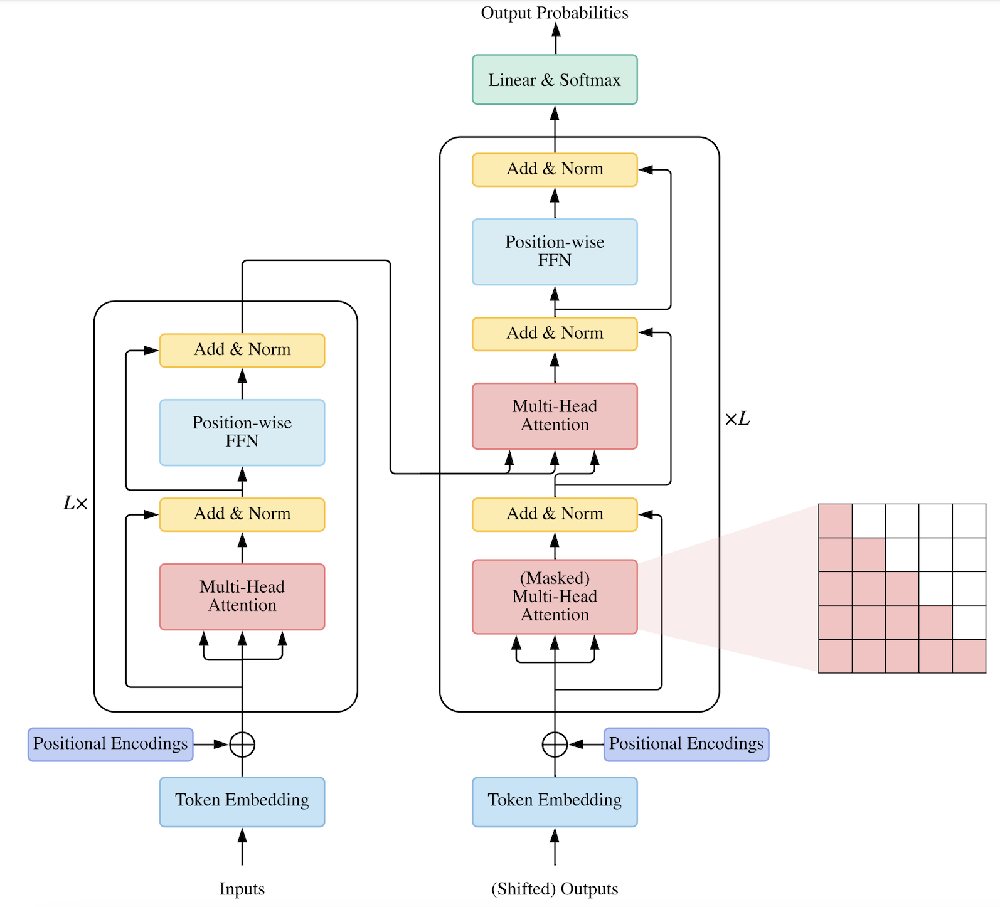
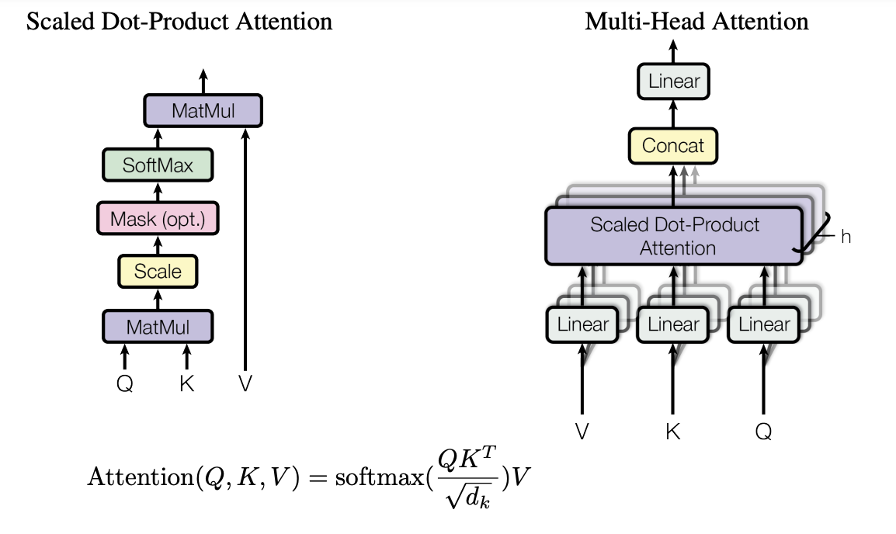

A PyTorch implementation of Transformer.
Paper [Attention is All You Need](https://arxiv.org/pdf/1706.03762.pdf) [Neurips 2017]



Architecture of vanilla Transformer [[Figure credit]](https://arxiv.org/pdf/2106.04554.pdf)


# Flow
### 1/ Raw input
A pair of sentences (`source_sentence`, `target_sentence`), e.g., one in English, the other in German as follows:


English: *And we 're going to tell you some stories from the sea here in video.*

German: *Wir werden Ihnen einige Geschichten über das Meer in Videoform erzählen.*

### 2/ Convert all the pairs into tokens and determine vocab size
```
src_tokenized_data =  ['And', 'we', "'re", 'going', 'to', 'tell', 'you', 'some', 'stories', 'from', 'the', 'sea', 'here', 'in', 'video', '.']
trg_tokenized_data =  ['Wir', 'werden', 'Ihnen', 'einige', 'Geschichten', 'über', 'das', 'Meer', 'in', 'Videoform', 'erzählen', '.']
````

**Vocab size**

source (English): 36k tokens

target (German): 59k tokens

### 3/ Create batches
Convert the list of tokens to id (index of the token in our vocab), add padding (e.g., id=1) at the end so that all sentences in a batch have the same length. These indices are used to get the embedding of corresponding tokens stored in `nn.Embedding`. Note that each batch should contain sentences of the same length to minimize padding.
````
src_token_ids_batch =[ [90,   267,    36,  18910,    11,  1788,     2,    51,    14,    15,  3054,    310,  18910,    11,  1949,     3,     1,     1,     1,     1,  1, ..., 1], ..., ]

src_token_ids_batch.size # torch.Size([10, 63]) => batch_size, max_len_tokens
````
Similarly, get tokens for `trg_token_ids_batch`. We need to create input for the decoder and labels for training.
    
+ Input for the decoder: `trg_token_ids_batch_input = trg_token_ids_batch[:, :-1]` # size = torch.Size([10, 50]). We remove the last token.
+ Labels for training: `trg_token_ids_batch_label = trg_token_ids_batch[:, 1:]` # size = torch.Size([500, 1]) => the label for training, we remove the first token (Begin of Sentence token), then flatten it for `LabelSmoothing()`
    
Finally, masks for attention to mask out padding and future tokens:
+ `src_mask`, size = torch.Size([10, 1, 1, 63]) # Mask for Attention in the encoder, and also for the Attention in the decoder
+ `trg_mask`, size = torch.Size([10, 1, 50, 50]) # pairwise mask for trg_token_ids_batch_input for Attention in the decoder

Summary: A batch consists of (and an example for each tensor's size) 

`src_token_ids_batch` torch.Size([10, 63])

`trg_token_ids_batch_input` torch.Size([10, 50])

`trg_token_ids_batch_label` torch.Size([500, 1])

`src_mask`  torch.Size([10, 1, 1, 63])

`trg_mask` torch.Size([10, 1, 50, 50])


### 4/ Transformer
From indices  `src_token_ids_batch` and `trg_token_ids_batch_input`, we get the embedding of each token which are initialized as random (store in `nn.Embedding`). This will be added up with positional_embedding. Thus, the input passed to transformer has a shape of (`batch_size` x `max_num_of_tokens`, `token_dimension`), then reshape to (`batch_size` x `num_heads` `max_num_of_tokens`, `token_dimension`) for multi-head.

**Attention weights**: (`batch_size` x `num_heads` x `max_num_of_src_tokens`x `max_num_of_src_tokens`) (`*`)  or  (`batch_size` x `num_heads` x `max_num_of_trg_tokens`x `max_num_of_src_tokens`) (`**`), or (`batch_size` x `num_heads` x `max_num_of_trg_tokens` x `max_num_of_trg_tokens`) (`***`) depending on the input fed into attentions (we have 3 slightly different attentions in transformer).




**Mask**: 
(`batch_size` x `1` x `1`x `max_num_of_src_tokens`) for attention (`*`) and (`**`)

(`batch_size` x `1` x `1` x `max_num_of_trg_tokens`) (*mask for padding in Keys, i.e., no attention to padding tokens*) `AND` (`batch_size` x `1` x `max_num_of_trg_tokens` x `max_num_of_trg_tokens`) (*mask for future tokens*) = (`batch_size` x `1` x `max_num_of_trg_tokens` x `max_num_of_trg_tokens`) for (`***`)

The inputs (src and trg token embeddings), outputs of the encoder, and output of the decoder all have the same size.

[Shared weights](https://github.com/pytorch/text/issues/678): share weight between emb layers and logit layer mentioned in the paper as follows.
*We trained on the standard WMT 2014 English-German dataset consisting of about 4.5 million
sentence pairs. Sentences were encoded using byte-pair encoding [3], which has a shared source-target vocabulary of about 37000 tokens.*
*we share the same weight matrix between the two embedding layers and the pre-softmax
linear transformation, similar to [[cite]](https://arxiv.org/pdf/1608.05859.pdf)*

So, instead of tokenizing source and target vocab separately, we can combine source and target sentences into one, then generate a shared vocab (say, 37k) for both of them (e.g.,
`    youtokentome.BPE.train(data="train.en_de"), vocab_size=37000,
                           model=os.path.join(data_folder, "bpe.model"))` with [youtokentome](https://github.com/VKCOM/YouTokenToMe))
````
self.trg_emd.weight = self.src_emb.weight ## point to the same parameter (tensor)
self.linear.linear_layer.weight = self.src_emb.weight
````

**Model Averaging**: generate `k` checkpoints, then take the average to create an ensembling effect.


---
**I found these resources very helpful when reimplementing the paper.**
- [The Annotated Transformer - HarvardNLP](https://nlp.seas.harvard.edu/2018/04/03/attention.html#positional-encoding)
- [Transformer - Aleksa Gordić's Github Repo](https://github.com/gordicaleksa/pytorch-original-transformer)
