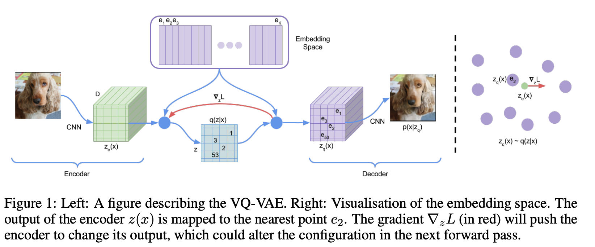
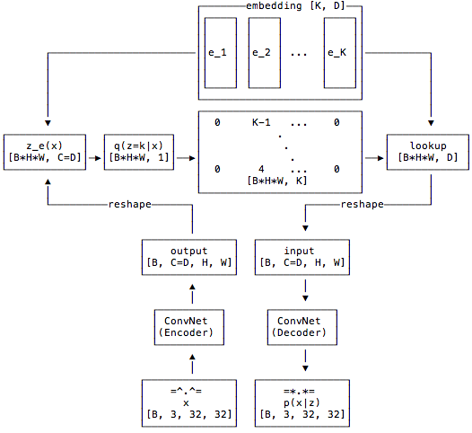

A Pytorch implementation of VQ-VAE (Vector Quantization - Variational Autoencoder). 
Paper: [Neural Discrete Representation Learning](https://arxiv.org/abs/1711.00937) (NeurIPS 2017)

  
Overview of VQ-VAE [pic from [1]]

## Side Notes: 
- straight-through estimator: copy grad from decoder to encoder
- Use moving average helps converge faster (2k epochs to make the loss <0.1, otherwise 6k)
- `self.ema_sum = self._moving_avg(self.ema_sum, sum_cluster_in_batch, self.decay).detach()`: Without detach(), it will cause out of mem
- perlexity: https://towardsdatascience.com/perplexity-intuition-and-derivation-105dd481c8f3?gi=6864ad453089
- 
## References

[1] https://github.com/zalandoresearch/pytorch-vq-vae/blob/master/vq-vae.ipynb

[2] [VQ-VAE v2 - NeuRIPS 2019] Generating Diverse High-Fidelity Images with VQ-VAE-2: https://arxiv.org/abs/1906.00446

